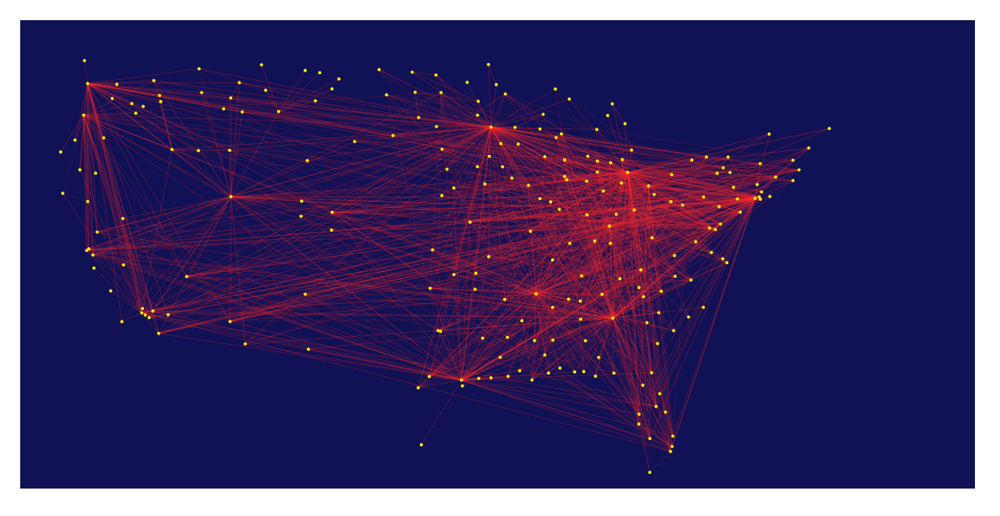
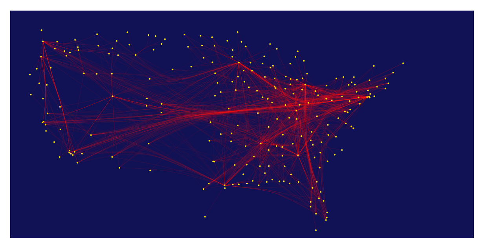

#d3.ForceBundle 
*Corneliu S.*
##### Javascript Force Edge Bundling for d3.js
 
---
## Description
#### Edge Bundling Algorithms (What Do They Do)
Node-link graphs with many edges and nodes suffer from visual clutter, edge-bundling algorithms transform and group the edges of a node-link graph in such a way as to improve the readability of the diagram. The process is for example analogous to bundling network cable wires along their route in order have a clear understanding of the links between entities and structural patterns of the network. There are several algorithms in this class, from ones that use hidden user-defined meshes to control the bundling **[1]**, to case specific ones such as for hierarchical data **[2]** and finally to self-organizing methods based on physical force interaction simulations **[3]**.
#### Force Edge Bundling
**Force edge bundling** **[3]** works by modelling edges between nodes as flexible springs which can attract each other if certain geometrical compatibility criterions are met. 
The input for the algorithm is a simple node-link diagram of a graph with nodes and edges. In order to change the shape of the basic straight line edges between nodes, the algorithm proceeds by subdividing edges into segments. Attraction *spring* forces are simulated between each pair of consecutive subdivision points on the same graph-edge. Moreover, attraction *electrostatic* forces are computed between subpoints of different edges which are geometrically compatible. The combined force acting on each subdivision point is computed and the points are moved a certain step size in the direction of the force. The force-simulation on these sub-points is repeted a certain amout of iterations. After the end of a cycle of iterations the resulting graph-edges are divided again in smaller segements and the whole process repeats itself until the end cycle is reached. It's important to note that the position of original node-points are fixed throughout the simulation.
#### Parameters Tuning
#####Fixed Parameters 
A certain number of parameters have been fixed to specific optimized values as found through experimentation by the authors. These include the spring constants **K** (=0.1), which controls the amount of bundling by controling the stiffness of edges. The number of iterations for simulating force interactions **I** (=60) and the number of cycles of subdivision-force simulation iterations **C** (=6). Moreover, the initial number of division points **P** is set to 1 and the rate at which it increases set to 2. The rate of the number of iterations **I** decreases each cycle is set to **2/3**.
All these parameters can be changed nonetheless if really needed by using the following methods:

- *bundling_stiffness ([new bundling stiffness: **float value**])*
- *iterations([new number of iterations to execute each cycle: **int value**])*
- *iterations_rate([new decrease rate for iteration number in each cycle: **float value**])*
- *cycles ([new number of cycles to execute: **int value**])*
- *subdivision_points_seed([new number subdivision points in first cycle: **int value**])*
- *subdivision_rate([new rate of subdivision each cycle: **float value**])*

##### Tuning Parameters For Your Specific Graph

Two parameters are **essential** for tuning the algorithm to produce usable diagrams for your graph. These are the geometric **compatibility score** above which pairs of edges should be considered compatible (default is set to 0.6, 60% compatiblity). The value provided should be between 0 and 1. Passing the new value to the  ***compatbility_threshold*** method will set the new threshold.

The **most important parameter** is the **initial step size** used to move the subdivision points after forces have been computed. This depends on both the scale of the graph and the number of edges and nodes contained. Having a step size which is too low will produce node-link like graphs while too high values will over distort edges. This can be set using the ***step_size*** function and passing your new step float size value. The default value is set to **0.1**.

##Usage
###Import The Plugin 
	
###Input Data
####Node Data
The Nodes and their positions are stored by their id in a basic dictionary.

	 var node_data = {"0":{"x":922.24444,"y":347.29444},
	  "1":{"x":814.42222,"y":409.16111},
	  "2":{"x":738,"y":427.33333000000005},
	  "3":{"x":784.5,"y":381.33333},
	  "4":{"x":1066.09167,"y":350.40278},
	  "5":{"x":925.4861099999999, "y":313.275}
	  }
####Edge Data
The edges are stored in an array, with each edge being represtend by an object with a *source* and *target* field. The id of the endpoints nodes are used as values. 

	var edge_data = [{"source":"0","target":"1"},{"source":"4","target":"2"},	 {"source":"0","target":"3"},{"source":"0","target":"4"},	 {"source":"2","target":"5"},{"source":"3","target":"2"},	 {"source":"3","target":"4"}]
	
###Output Data
The algorithm outputs an array of arrays of subdivision points obtained on the last cycle of the algorithm. For each initial edge we now have an array of subpoints. See dumbed-down example output below:

		[[{"x":598.84446872426,"y":345.9168478350515},
		  {"x":598.8966169857991,"y":342.6143388013737},
		  {"x":598.9447663612947,"y":339.5650761251721},
		  {"x":598.9889739987847,"y":336.00915574486953}],
		  
		 [{"x":599.0255639503467,"y":332.7064433315037},
		  {"x":599.0458427562561,"y":329.649667740391},
		  {"x":599.0688393833738,"y":326.1832146974663},
		  {"x":599.0815403651777,"y":322.79784918535125}],
		  
		 [{"x":599.093286694284,"y":319.49494996957446},
		  {"x":599.0826911541287,"y":316.20380716501853},
		  {"x":599.0720260264579,"y":312.8891427199991},
		  {"x":599.0626270188833,"y":309.96251327852605}],
		  
		 [{"x":599.0490564253139,"y":306.2833476821561},
		  {"x":599.0143146564005,"y":303.088731096524},
		  {"x":598.9769445742103,"y":299.67789993507586},
		  {"x":598.9402957673196,"y":296.5373242419396}]]
###Running the algorithm
####With Default Parameters Values:
	var fbundling = d3.ForceEdgeBundling().nodes(node_data).edges(edge_data);
	var results   = fbundling();	
	
####With Custom Parameters Values
	var fbundling = d3.ForceEdgeBundling().step_size(0.2).compatibility_threshold(0.9).nodes(node_data).edges(edge_data);
	var results   = fbundling();	  
	
###How To Plot
Plotting can be done by using standard *d3* methods i.e. drawing lines between each of the subdivision subpoints for each the initial graph edges. Since there is no support for advanced blending modes in **SVG** yet we use the *stroke-opacity* to mark overlapping segments.

		var d3line = d3.svg.line()
                        .x(function(d){return d.x;})
                        .y(function(d){return d.y;})
                        .interpolate("linear");
                        
        results.forEach(function(edge_subpoint_data){	
        // for each of the arrays in the results 
        // draw a line between the subdivions points for that edge
        
        	svg.append("path").attr("d", d3line(edge_subpoint_data))
            	.style("stroke-width", 1)
            	.style("stroke", "#ff2222")
            	.style("fill", "none")
            	.style('stroke-opacity',0.15); //use opacity as blending
        });
        
##Example
##### For source code see **example/airline_routes.html**.
##### Node-Link
 
##### After FDEB 
 

## Future Extenions

- Barnes Hunt methods to optimize force calculations. 
- Use a color gradient to color edge subsegments with respect to number of overlapping subedges.
- Add edge smoothing support for subdivision points using a Gaussian kernels. 
- Automatical intialization with optiomum step size with respect to given graph.

## Paper References

[1] Cui, Weiwei, et al. "Geometry-based edge clustering for graph visualization." Visualization and Computer Graphics, IEEE Transactions on 14.6 (2008): 1277-1284.

[2] Holten, Danny. "Hierarchical edge bundles: Visualization of adjacency relations in hierarchical data." Visualization and Computer Graphics, IEEE Transactions 12, no. 5 (2006): 741-748.

[3] Holten, Danny, and Jarke J. Van Wijk. "Force‐Directed Edge Bundling for Graph Visualization." Computer Graphics Forum (Blackwell Publishing Ltd) 28, no. 3 (2009): 983-990.